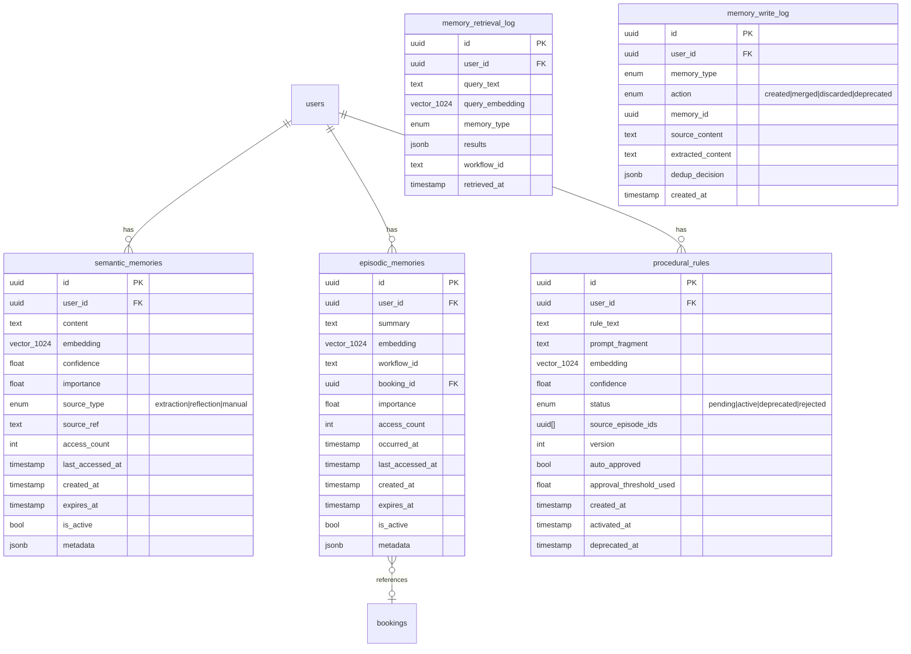

# ADR-0001: Agentic Memory System

**Status:** Approved — awaiting implementation  
**Date:** 2026-04-24  
**Deciders:** jrdym + Claude  

---

## Context

Tino 2's agentic assistant (coordinator → requirements → search → recommendation → verification pipeline) starts cold on every session. Users must re-state location, budget, preferences, and constraints each time. The system has no awareness of past bookings, stated preferences, or behavioral patterns.

Goal: add a production-grade memory layer so the agent (a) retains relevant facts across sessions and (b) adapts behavior over time from past interactions.

---

## Decisions

### D1 — Framework: Direct Implementation (Option A)

**Rejected:** Mem0 (Python-first, JS SDK lags), LangGraph/LangMem (Python-first, TypeScript port materially behind, opinionated orchestration conflicts with existing coordinator).

**Chosen:** Direct implementation on top of pgvector + Claude tool use. The stack is TypeScript/Express/TypeORM — no Python runtime, no new orchestration framework. Full ownership of the memory stack gives maximum learning value and zero framework lock-in. Everything is built in under a week per phase.

### D2 — Embedding Model: Voyage AI (`voyage-3`)

> **Superseded in August 2026:** embeddings now use the provider-neutral
> `AI_EMBEDDING_CHAIN`. The tested all-OpenAI profile uses
> `openai:text-embedding-3-small` at 1,024 dimensions, with optional Voyage targets as
> configured fallbacks. Model identifiers are not hard-coded in memory services.

> Superseded in implementation: embeddings now use the provider-neutral
> `AI_EMBEDDING_CHAIN`, supporting ordered OpenAI and Voyage targets with no
> runtime model default. This section records the original design decision.

Anthropic's partnership embedding model. 1024-dimensional vectors, strong retrieval quality, available via REST, TypeScript-friendly. Cost ~$0.06/1M tokens — negligible at beta traffic.

For dev: `voyage-3-lite` (same API, cheaper, faster). Swap is one config line.

**Not chosen:** `text-embedding-3-large` (OpenAI — unnecessary second LLM vendor). `text-embedding-3-small` retained as fallback if Voyage has outage.

### D3 — Vector Store: pgvector on PostgreSQL

Same PostgreSQL instance already used in production. No new service, ACID transactions, query joins between memory tables and existing booking/review data, TypeORM compatible.

**Dev:** PostgreSQL locally via Docker (`docker compose up postgres`) — no SQLite compatibility layer. This also eliminates the dev/prod schema drift problem we had with SQLite.

### D4 — Memory Scope

Per-user. Customer users in Phase 1. Provider users in Phase 2 after customer approach is validated.

### D5 — Procedural Rule Approval

Tiered confidence threshold:

| Confidence | Action |
|------------|--------|
| ≥ 0.85 | Auto-approve + notify user (can revert anytime) |
| 0.65–0.84 | Queued as `pending` — surfaced in memory settings UI for 1-click accept/dismiss |
| < 0.65 | Discarded |

Beta: controlled by `PROCEDURAL_RULE_AUTO_APPROVE_THRESHOLD=0.85` env var.

**⚠️ PENDING DECISION:** Who reviews the pending queue at scale — user, admin, or automated re-evaluation? Deferred until Phase 6 (procedural rules UI).

### D6 — PII / Consent

Opt-out with disclosure. PII scrubbing pass on every write: phone numbers, exact street addresses, and financial identifiers are redacted before storage. City/neighborhood is retained (operationally necessary for a location-based service). Users can view, edit, and delete all their memories via API and UI.

---

## Memory Types

### Type 1: Semantic Memory

Durable facts and preferences about the user. Written after each session turn by the extractor. Deduplicated on write via embedding similarity.

**Examples:**
- "User lives in Lagoa da Conceição, Florianópolis"
- "User's typical cleaning budget is R$200–R$350"
- "User has a dog; prefers pet-friendly providers"
- "User prefers eco-friendly cleaning products"

**Retention:** 365-day TTL with recency decay. High-access memories persist indefinitely.

### Type 2: Episodic Memory

Summaries of specific agentic sessions with temporal context. Written at session end. References existing DB rows rather than duplicating data.

**Examples:**
- "2026-04-10: User searched for deep cleaning in Lagoa. Booked Maria Santos (provider #42). Gave 5 stars. Mentioned it was for a pre-party clean."
- "2026-04-18: User asked about plumbers twice. Both times filtered for licensed providers. Session did not result in booking."

**Retention:** 180-day TTL. Linked to `bookings.id` and `workflow_id` where applicable.

### Type 3: Procedural Rules

Agent behavioral rules derived from episodic patterns via the reflection job. Injected directly into the system prompt when active.

**Examples:**
- "When this user asks for cleaners, always ask about pet allergies before presenting results."
- "This user consistently rejects providers with fewer than 10 reviews. Apply minimum_reviews ≥ 10 filter automatically."

**Retention:** No TTL. Rules are deprecated (not deleted) when superseded or rejected by the user.

---

## Data Model



---

## Hybrid Retrieval Scoring Formula

Applied to semantic and episodic memory. Procedural rules are retrieved in full (filter `status = 'active'` for the user — no ranking needed).

```
score(m, q) = α·sim(q, m) + β·recency(m) + γ·importance(m) + δ·access_boost(m)
```

### Components

```
sim(q, m)        = cosine_similarity(embed(q), embed(m))          -- [0, 1]

recency(m)       = exp(-λ · days_since(m.last_accessed_at))       -- λ = 0.05
                   (half-life ~14 days)

importance(m)    = m.confidence · (1 + log₂(1 + m.access_count))  -- unbounded, normalized

access_boost(m)  = min(m.access_count / 20, 1.0)                  -- [0, 1]
```

### Default Weights

| Weight | Semantic | Episodic | Notes |
|--------|----------|----------|-------|
| α (similarity) | 0.55 | 0.45 | Semantic: content match is primary |
| β (recency) | 0.15 | 0.30 | Episodic: recency matters more |
| γ (importance) | 0.20 | 0.15 | Confidence-weighted |
| δ (access boost) | 0.10 | 0.10 | Popularity signal |

All weights are configurable via env vars. Sum always = 1.0.

### Top-K per type

| Type | Default K | Token budget |
|------|-----------|-------------|
| Semantic | 5 | 200 tokens |
| Episodic | 3 | 150 tokens |
| Procedural | all active | 100 tokens |
| **Total** | — | **450 tokens** |

---

## Context Injection — System Prompt Template

Injected at the start of every agentic assistant turn, before the agent's own system prompt.

```
<memory>
[O QUE SEI SOBRE VOCÊ]
{semantic_memories_formatted}

[CONTEXTO RECENTE]
{episodic_memories_formatted}

[PREFERÊNCIAS ATIVAS]
{procedural_rules_formatted}
</memory>
```

**Rendered example:**
```
<memory>
[O QUE SEI SOBRE VOCÊ]
• Você mora em Lagoa da Conceição, Florianópolis
• Seu orçamento habitual para limpeza é R$200–R$350
• Você tem um cachorro e prefere prestadores pet-friendly
• Prefere produtos de limpeza ecológicos

[CONTEXTO RECENTE]
• 10/04: Contratou Maria Santos para limpeza profunda. Avaliou com 5 estrelas.
• 18/04: Pesquisou encanadores duas vezes. Priorizou prestadores licenciados.

[PREFERÊNCIAS ATIVAS]
• Ao buscar limpeza: verificar alergias a produtos antes de apresentar resultados.
</memory>
```

If no memories exist for a user, the `<memory>` block is omitted entirely.

---

## Write Path

```
session ends / turn completes
        │
        ▼
  ExtractionAgent (Claude Haiku)
  - reads last N turns of conversation
  - proposes: new semantic facts, episodic summary
  - outputs structured JSON
        │
        ▼
  Deduper
  - for each proposed fact:
    - embed the candidate
    - cosine search existing memories (threshold: 0.92)
    - if similar found: update confidence, merge, log action='merged'
    - if no match: insert new memory, log action='created'
    - if confidence too low: discard, log action='discarded'
        │
        ▼
  PII scrubber
  - regex pass (phone, CPF, card numbers, exact addresses)
  - flag for manual review if detected
        │
        ▼
  Write to DB + generate embedding
```

Extraction runs **async** (post-turn, non-blocking) — does not slow down the user-facing response.

---

## Reflection Job

Runs nightly (node-cron) or on-demand.

```
for each active user with ≥ 3 new episodes since last reflection:
  1. fetch last 20 episodic memories
  2. ask Claude Sonnet to identify patterns → propose:
     a. new semantic facts ("User consistently books on weekends")
     b. new procedural rules ("Always filter for licensed providers for this user")
  3. semantic facts → dedup pipeline (same as write path)
  4. procedural rules → confidence scored
     - confidence ≥ threshold: auto-approve + notify user
     - confidence < threshold: queued as 'pending'
```

---

## Forgetting

| Mechanism | Behavior |
|-----------|----------|
| TTL | Semantic: 365d, Episodic: 180d, Procedural: never |
| Importance decay | importance halves every 90 days if access_count doesn't grow |
| Explicit delete | `DELETE /api/v1/memory/memories/:id` — soft delete (is_active=false) |
| "Forget that" utterance | Detection in requirements agent → triggers explicit delete |
| PII scrubbing | Phone/CPF/card numbers redacted on write; cannot be retroactively stored |

---

## Observability

Every retrieval writes a row to `memory_retrieval_log` (query, results, scores, workflow_id).  
Every write writes a row to `memory_write_log` (source, extracted, dedup decision, action).

Admin endpoint: `GET /api/v1/admin/memory/stats` — per-user memory counts, retrieval hit rates, top retrieved memories.

User endpoint: `GET /api/v1/memory/memories` — user's own memories, paginated, filterable by type.

---

## Implementation Phases

| Phase | Deliverable | Key files |
|-------|-------------|-----------|
| 1 | Schema (TypeORM migrations), pgvector setup, embedding service abstraction | `src/config/memory.ts`, `src/migrations/`, `src/services/memory/EmbeddingService.ts` |
| 2 | Semantic memory write path: ExtractionAgent + Deduper + PII scrubber | `src/agents/memory/ExtractionAgent.ts`, `src/services/memory/Deduper.ts` |
| 3 | Semantic memory read path: hybrid retrieval + context injection | `src/services/memory/MemoryRetriever.ts`, `src/services/memory/ContextInjector.ts` |
| 4 | Episodic memory (session summaries, DB linkage) | `src/agents/memory/EpisodicWriter.ts` |
| 5 | Reflection job: episodes → semantic facts + procedural rules | `src/jobs/reflection.job.ts` |
| 6 | Procedural rules: review queue, auto-approval, injection | `src/services/memory/ProceduralRuleService.ts` |
| 7 | User-facing API (list/search/delete) + Admin stats | `src/routes/memory.ts` |
| 8 | Evaluation harness: multi-session behavioral tests | `tests/memory/` |

---

## Test / Validation Strategy

### Layer 1 — Unit (deterministic)
- **Extractor:** fixture conversation → assert extracted facts match expected JSON
- **Deduper:** existing memory M + near-duplicate M' → assert merge, not duplicate insert
- **Retrieval ranker:** 5 memories with known scores → assert correct rank order
- **Reflection job:** 3 fixture episodes with repeated pattern → assert procedural rule generated

### Layer 2 — Integration (seeded DB)
- Full write path: POST fake conversation → assert correct rows in `semantic_memories`
- Full read path: query "find a cleaner" with seeded user profile → assert `<memory>` block contains expected facts
- Dedup across sessions: same fact in 2 sessions → single row, updated confidence

### Layer 3 — Behavioral (snapshot-style)
Tests assert on **system prompt content** (what gets injected), not LLM output (non-deterministic).

| Scenario | Session 1 | Session 3 assertion |
|----------|-----------|-------------------|
| Preference learning | User mentions eco-friendly preference | `<memory>` block contains eco-friendly fact without user re-stating it |
| Budget retention | User states R$300 budget | Budget appears in injected context, search filters apply it |
| Negative experience | User gives 1-star review, mentions punctuality | Episodic memory records it; procedural rule proposed after 2 occurrences |

The behavioral test doesn't call the LLM — it calls the retriever and asserts on the retrieved + injected context payload.

---

## Three Riskiest Parts

1. **Dedup threshold calibration** — 0.92 cosine similarity is a guess. Too high: duplicates accumulate. Too low: valid distinct memories get merged. Needs empirical tuning with real user data. Mitigation: make the threshold configurable, log every dedup decision, build a review tool in Phase 7.

2. **Extraction quality** — the ExtractionAgent (Claude Haiku) must reliably extract factual, atomic statements from messy conversational turns. If it hallucinates or mis-extracts, bad data poisons the memory store. Mitigation: strict output schema, confidence scoring, unit tests with adversarial fixture conversations.

3. **Token budget pressure** — as users accumulate memories, the 450-token injection budget becomes a competition. The scoring formula must surface the most contextually relevant memories, not just the oldest or highest-importance. Mitigation: query-time scoring (not static ranking), test with users who have 50+ memories.

---

## Open / Pending Decisions

- **⚠️ Procedural rule review queue at scale:** Who reviews pending rules — user self-service, admin, or automated re-evaluation after more evidence accumulates? Deferred to Phase 6.
- **⚠️ Provider memory scope:** Identical architecture, separate rollout. Revisit after customer memory is validated in beta.
- **⚠️ Embedding model for dev:** `voyage-3-lite` vs `text-embedding-3-small` — pick whichever is faster to set up. Swap is one config line.
